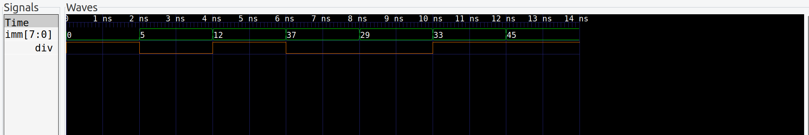
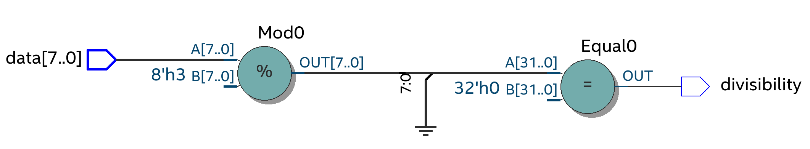
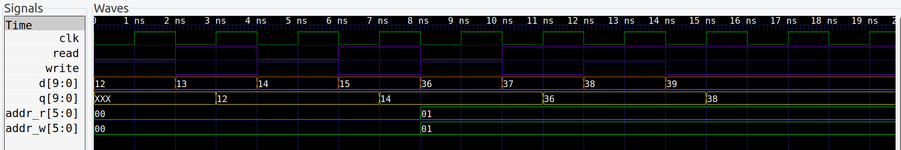
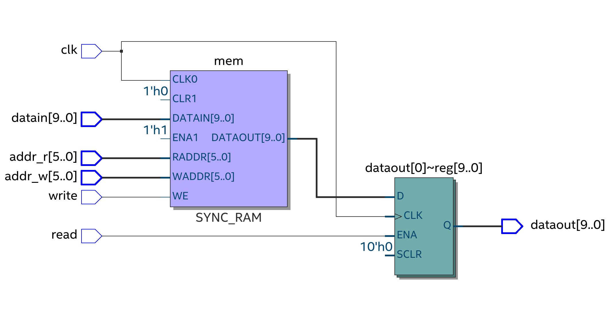

# DIVISIBILITY_BY_3 & RAM
 Two simple projects for the implementation of divisibility testing at 3 and memory module.

## DIVISIBILITY_BY_3
 
 
###  How to build 
in folder div_by_3/
```
    make div_by_3
    vvp div_by_3
```
###  How to run GTKWave
in folder div_by_3/
```
   gtkwave dump.vcd
```

## RAM

 
 
 
###  How to build RAM
in folder memory/
```
    make memory
    vvp memory
```
###  How to run GTKWave
in folder memory/
```
   gtkwave dump.vcd
```
